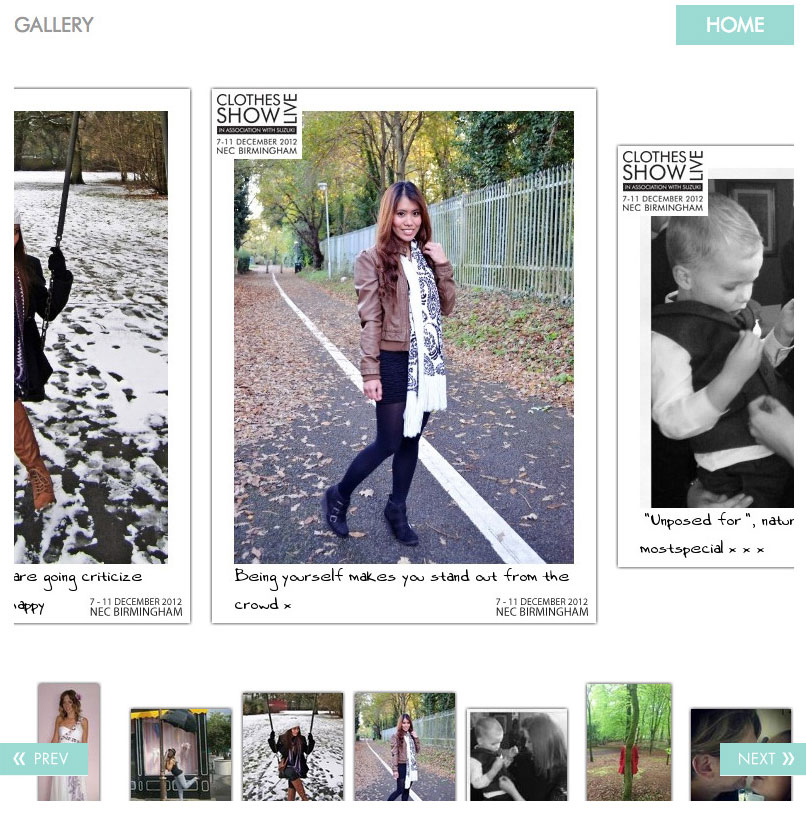

## Are you the heart of British Fashion?

The Clothes Show is a yearly fashion event and in 2012 they showcased more than the models on the catwalk. Their fans got in on the action too.

We developed an app designed to work inside a Facebook canvas, as well as an iframe to be embedded on 3rd party websites. It allowed users to upload a photo, or choose from their Facebook albums. And customize it with text.

A personalized image was then created server side using Imagemagick and added to the public gallery.

A backend moderation tool was also developed to allow the user generated content to be screened before being made public.

