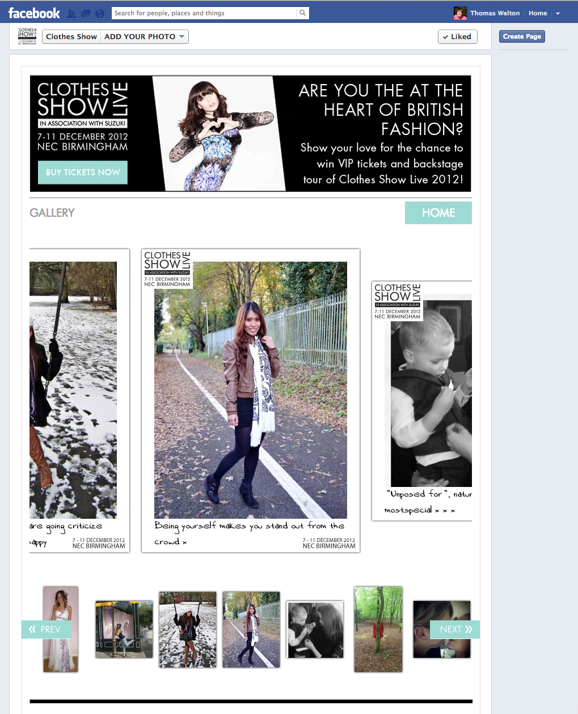

## Are you the heart of British Fashion?

The Clothes Show is a yearly fashion event and in 2012 they showcased more than the models on the catwalk. Their fans got in on the action too.

**Role:** Lead Developer 
**Date:** Mid 2012 
**Tech:** PHP, imagemagick, Javascript, Facebook API 

The app was designed to work inside a Facebook canvas, as well as an iframe to be embeded on 3rd party websites. It allowed user to upload a photo, or choose from their Facebook albums. And customise it with text. A personalised image was then created server side using Imagemagick and added to the pulic gallery.

