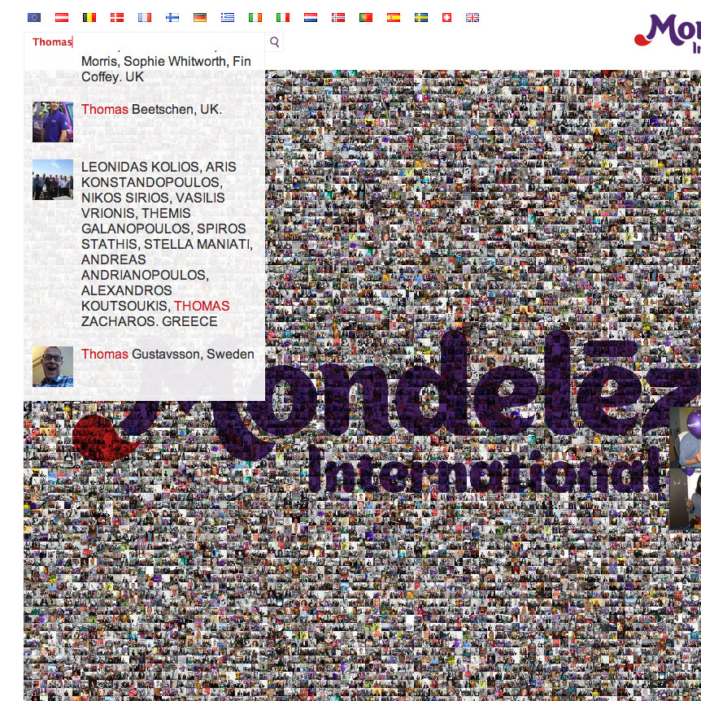
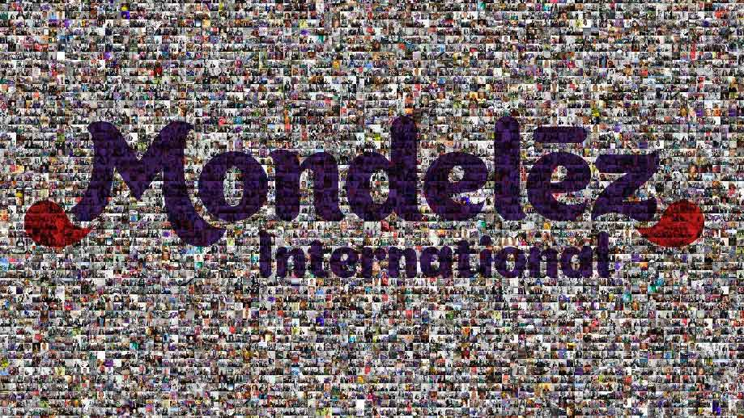

## Rebrand from Kraft foods

Kraft foods became Mondelez in September 2012. To celebrate the rebrand ,and to show the people that made up the new international team, the Faces of Mondelez micro site was created.

Staff could submit their photos by sending them in an email to an internal address. Or designated admins could upload photos individually or as a zip file to the admin tool.

Photo descriptions would be scrapped from the email text and allow staff to search for their image as well as allowing others to find out more about the faces in the photos.

Each individual thumbnail made up a huge interactive photo wall, which could be moused over to view a larger view of that region.

