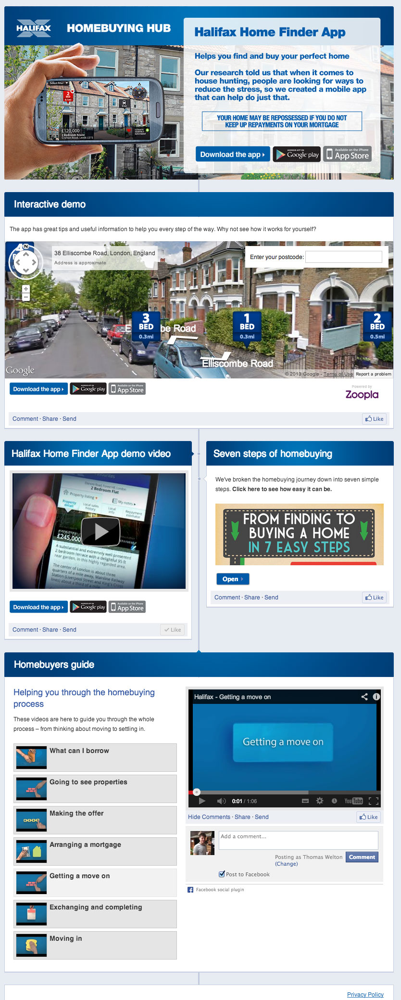

## Mortgage Advice, brought home

To help promote their new mobile app, and provide advice to their customers Halifax created the Facebook Homebuying Hub. A Facebook canvas and Tab application.

I developed the framework for the homebuying hub. Built on the Joomla CMS it had a simple to use administration interface which allowed the client to position and configure the different modules on the page as well as manage the user generated content.

The hub featured a custom made youtube slideshow widget. An ask an expert section allowing users to ask DIY and Home experts like Tommy Walsh and Charlie Dimmock their questions. As well as an interactive map showing users the trend in house prices of the last decade.

