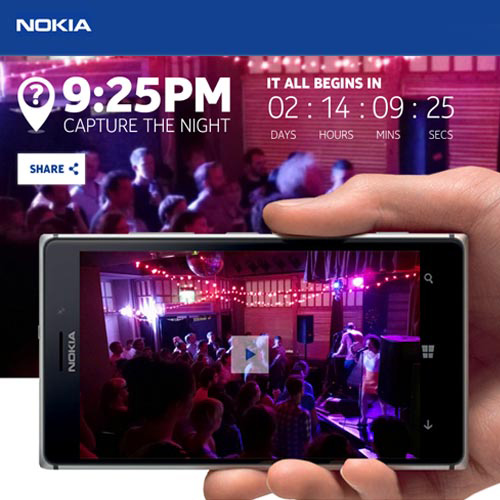

## Capture the Night

To celebrate the launch of the Lumia 925 we created the Facebook game "Capture the Night". Fifteen phones were hidden in locations across the UK, and at 9:25pm a photo was taken and uploaded to our app, where users could try and guess the location. The first person to guess each location would win the phone and even a trip to New York.

Built on CodeIgniter, the application hooked into the Faacebook API to authenticate users and pull in some personalization and contact information. Users could submit up to 5 guesses per location, per day and then come back tomorrow to try again. Guesses were ran through a profanity filter and displayed on the app for others to see. The first person to guess the location against a set of allowed variations were immediately notified they'd won a new Lumia 925!

The game moved very quickly as locations were guessed by users all across the country. But for the last location the application switched into a new mode and mechanic. Instead of just guessing the correct location, you had to get there, and get yourself in the photo. First person to appear in the photo and tag themselves on Facebook would win the grand prize of a trip to New York.

The main game mechanic ran for a few days. And as it was so successful we were asked to create a new alternative that could run for much longer. In less than one day we updated the app so users would now guess the time that photos were taken, and if guessed correctly they would be entered into an prize draw.

[See the video](http://www.youtube.com/watch?v=uXEpQpZIqGw)
[Read More](http://www.wpcentral.com/nokia-launches-capture-night-win-lumia-925-trip-to-ny)

