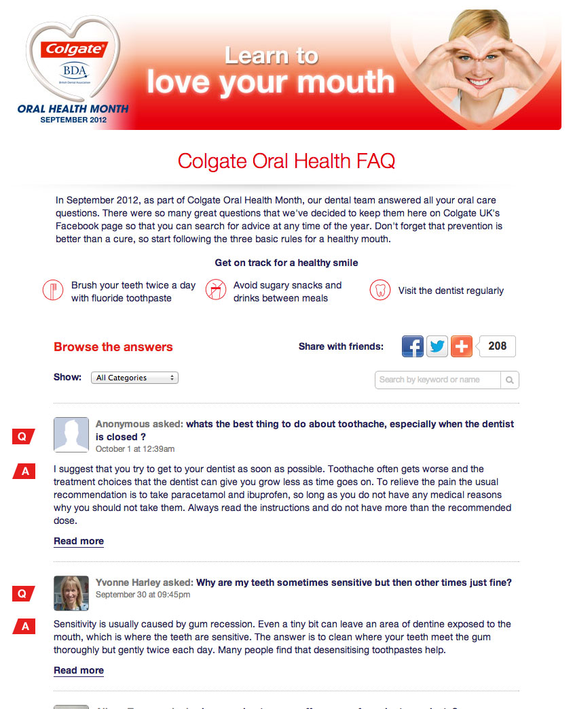

## Speak to a Dentist, avoid the waiting room

September is Colgate's Oral Health Month. An integral part to good oral hygiene is access to a Dental professional. Which isn't always as convenient as it could be. Which is why for the month of September Colgate brought the dentists to their customers with the OHM microsite and Facebook application.

The application provided users with information about the UK wide OHM roadshow tour dates, as well as the opportunity to ask a dentist their questions online.

Questions could be asked anonymously, or publicly. And once answered by a Dentist the user would receive and email notification with a link to view the answer within the app.

User submissions were processed via the admin interface and videos responses from Youtube could be attached to answers to provide more information.

