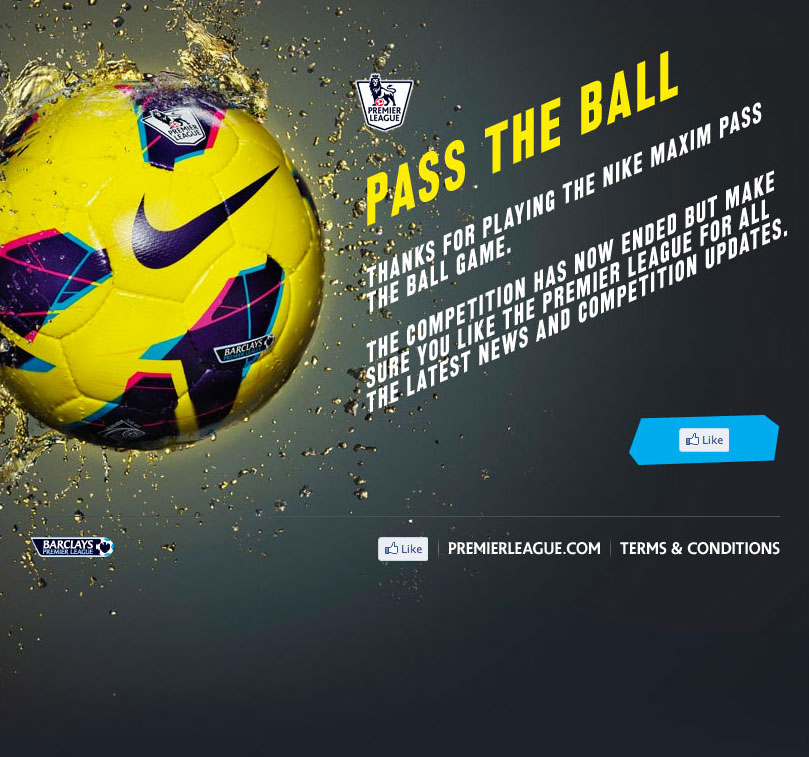

## Rally up your friends, you have 90 minutes

To promote the launch of the new Nike maxim high visibility ball The Premiere League created a game their fans would love. Start a game, and pass the ball to as many of your friends as possible the most passes in 90 minutes would win an exclusive trip to Dubai.

The application connected to the Facebook API, and allowed users to pass the virtual ball to their friends, who could go on again to pass it to others. At the end of each 90 minute game the total number of passes was calculated and posted to the leader board.

The game ideas was simple, but highly effective. It drew huge user engagement and hundreds of passes were made per game.

