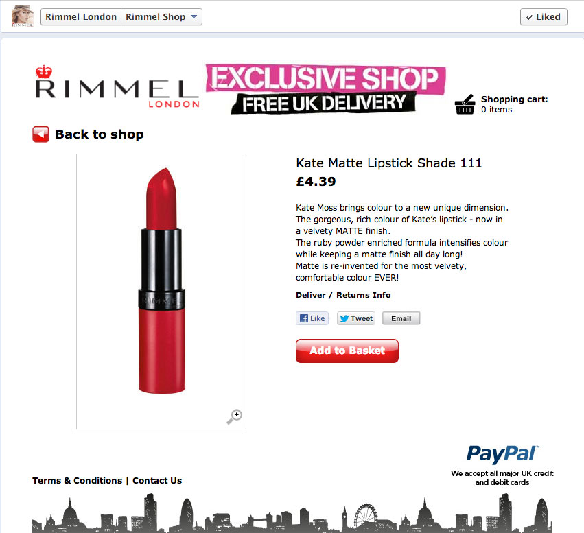

## Facebook Ecommerce Platform

With almost a quarter million fans on the [Rimmel Facebook page](http://www.facebook.com/rimmellondon) it is a perfect place for an ecommerce platform. I was the lead developer in implementing the custom ecommerce platform for [COTY](http://www.coty.com/brands/rimmel).

The application needed to be able to manage multiple stores, allowing COTY to create a new Facebook application from the admin interface and accept payments via paypal.

Since it's launch in early 2012 the store has been used to sell new products directly to customers before they hit the stores.

