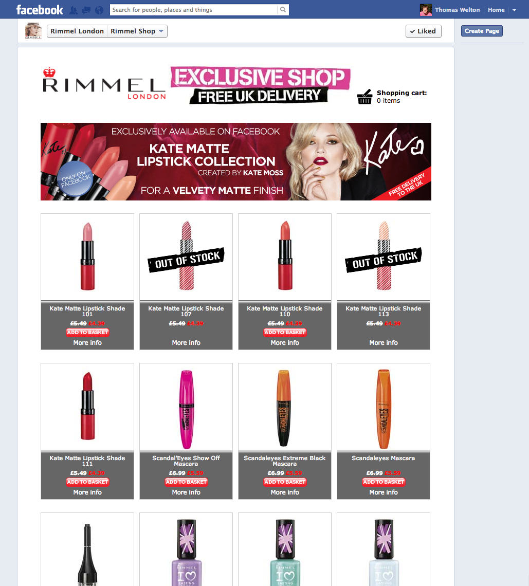

With almost a quarter million fans on the Rimmel Facebook page it is a perfect place for an ecommerce platform. I was the lead developer in implementing the custom build for COTY.
The store need to be linked to Paypal and come with an easy to use admin tool to allow for products and themes to be applied to the site by the client.
Since it's launch in early 2012 the store has been used to sell new products dirctly to customers before they hit the stores.

COTY - http://www.coty.com/brands/rimmel
Rimmel - http://www.rimmellondon.co.uk/
Twitter - http://twitter.com/Rimmelondonbuzz
Facebook - http://www.facebook.com/rimmellondon

Paypal - https://www.paypal.com

