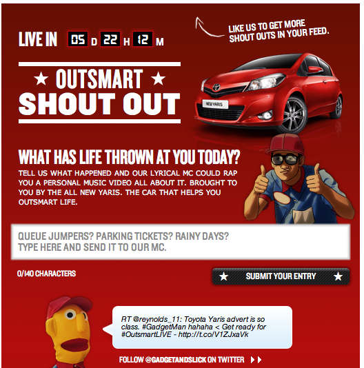

## What has life thrown at you today?

"Shout Out" was the first project I worked on at clickTag. I was the only web developer on the project and was responsible for the development, hosting and deployment of the application. The campaign was created by [Saatchi & Saatchi](http://www.saatchi.co.uk/news/archive/toyota_yaris_and_saatchi__saatchi_outsmart_life_with_personalised_shout_out_social_media_campaign_) and [Cubakka](http://cubaka.com/).

The campaign focused around two existing charecters, Gadget & Slick. During the live 3 day event users could submit ideas that would be recorded into personalised rap videos. Check out the [Youtube playlist](http://www.youtube.com/playlist?list=PL933475BEE4010FD9&feature=plcp)

The application was tailored for both Facebook and Twitter. Users could tweet entries using a hashtag, or submit entries in the Facebook application. In total 125 videos were created for our users.

