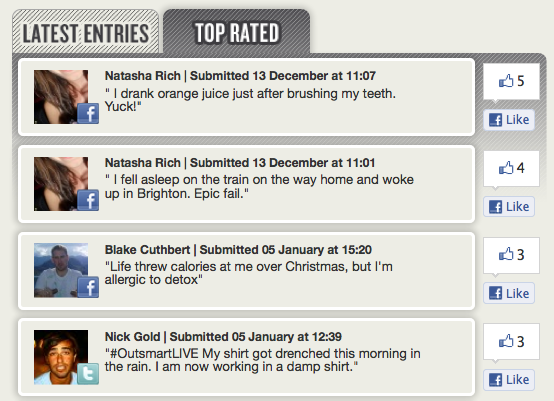

Teaser Video - http://www.youtube.com/watch?v=y1xV4nsjyd0

What has life thrown at you today?

"Shout Out" was the first project I worked on at clickTag. I was the only web developer on the project and was responsbile for the development, hosting and deployment of the application.
The campaign was created by Saatchi & Saatchi and Cubakka and focused around two existing charecters, Gadget & Slick. During the live 3 day event user could submit ideas that would be recorded into personalised rap videos.
The application was tailored for both Facebook and Twitter. Users could tweet entries using a hashtag, or submit entries in the Facebook application. In total 125 videos were created for our users.

Playlist - http://www.youtube.com/playlist?list=PL933475BEE4010FD9&feature=plcp

Featured

econsultancy - http://econsultancy.com/uk/blog/8617-toyota-launches-personalised-shout-out-social-media-campaign
wcommunications - http://wcommunications.co.uk/2012/01/toyota-yaris-let-gadget-slick-write-the-rhymes/
saatchi - http://www.saatchi.co.uk/news/archive/toyota_yaris_and_saatchi__saatchi_outsmart_life_with_personalised_shout_out_social_media_campaign_

