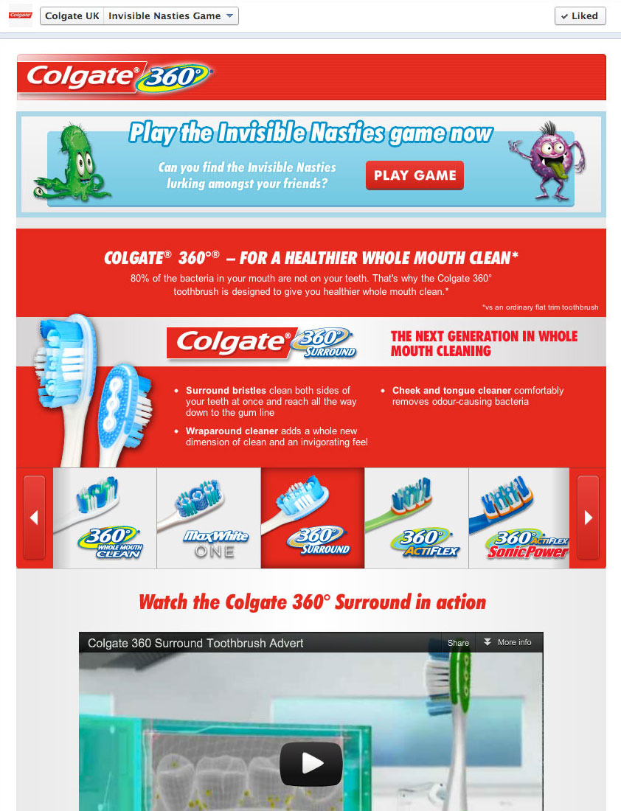
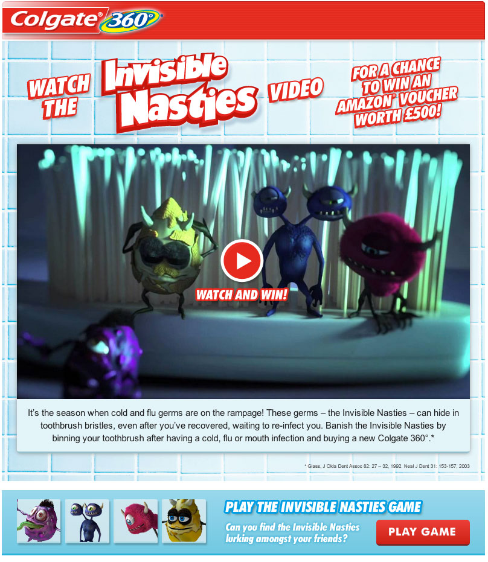

## Find the Invisible Nasties

What's lurking in your toothbrush? If it hasn't been changed recently then if you look close enough you're likely to find some ["invisible nasties"](http://www.colgate.co.uk/Colgate360/UK_v2/campaigns/Toothbrushes-Invisible-Nasties/Characters/). The nasties are a group of characters created by [Colgate](http://www.colgate.co.uk/app/Colgate/UK/HomePage.cvsp) that usually spend their time hidden in your toothbrush. But now they're hiding amongst your friends too.

We developed a Facebook game and promo page to promote Colgate's range of toothbrushes. The game took the profile pictures of your friends and hid one of the invisible nasty characters within them. Users had to click on as many of the nasties as they could see within 45 seconds and on completion of the game could claim discount vouchers for Colgate products.

The application ran for about a year and a half and was updated many times to include new product ranges and [TV commercials](http://www.youtube.com/watch?v=Rri0EvJ0zzs).

